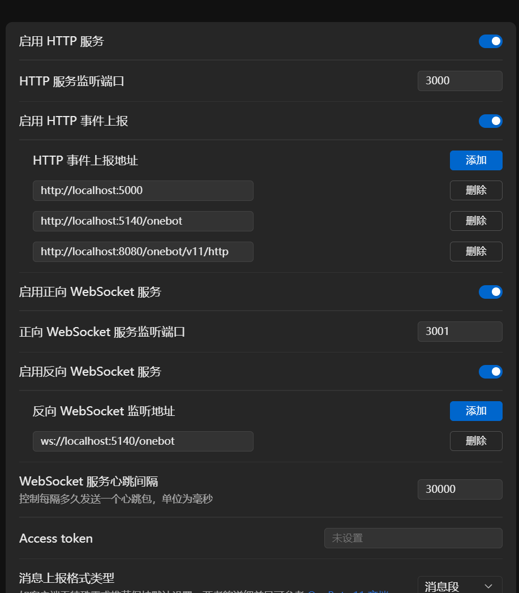

# LLOneBot

LiteLoaderQQNT 插件，实现 OneBot 11 和 Satori 协议，用于 QQ 机器人开发

> [!CAUTION]\
> 请不要在 QQ 官方群聊和任何影响力较大的简中互联网平台（包括但不限于: 哔哩哔哩，微博，知乎，抖音等）发布和讨论任何与本插件存在相关性的信息

TG 群：<https://t.me/+nLZEnpne-pQ1OWFl>

## 安装方法

见 <https://llonebot.github.io/zh-CN/guide/getting-started>

## 设置界面

## 支持的 API

见 <https://llonebot.github.io/zh-CN/develop/api>

## Stargazers over time

## 贡献者

## 鸣谢

- [NapCatQQ](https://github.com/NapNeko/NapCatQQ)，依照开源协议参考了其部分代码
- [LiteLoaderQQNT](https://liteloaderqqnt.github.io/guide/install.html)
- [Chronocat](https://github.com/chrononeko/chronocat)
- [koishi-plugin-adapter-onebot](https://github.com/koishijs/koishi-plugin-adapter-onebot)
- [silk-wasm](https://github.com/idranme/silk-wasm)

## 特别感谢曾经在LLOneBot贡献的人员

- [MliKiowa(拾雪)](https://github.com/MliKiowa)

- [MisaLiu](https://github.com/MisaLiu)

## 友链

- [Lagrange.Core](https://github.com/LagrangeDev/Lagrange.Core): An Implementation of NTQQ Protocol
