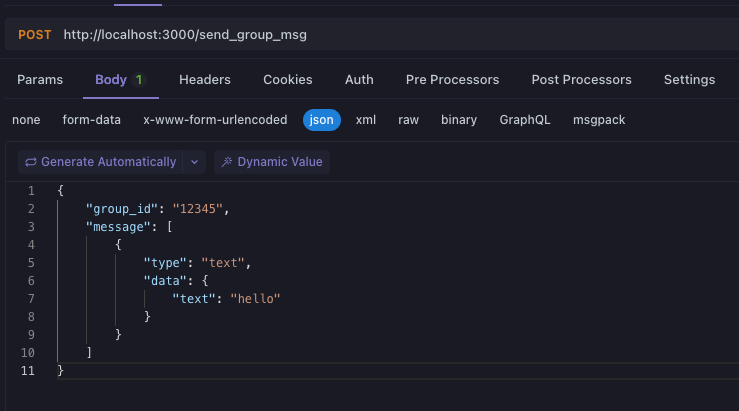

# LLOneBot API
LiteLoaderQQNT的OneBot11协议插件

TG群：<https://t.me/+nLZEnpne-pQ1OWFl>

*注意：本文档对应的是 LiteLoader 1.0.0及以上版本，如果你使用的是旧版本请切换到本项目v1分支查看文档*

*V3之后不再需要LLAPI*

## 安装方法

1.安装[LiteLoaderQQNT](https://liteloaderqqnt.github.io/guide/install.html)

2.安装本项目插件[OneBotApi](https://github.com/linyuchen/LiteLoaderQQNT-OneBotApi/releases/), 注意本插件2.0以下的版本不支持LiteLoader 1.0.0及以上版本

*关于插件的安装方法: 下载后解压复制到插件目录*

*插件目录:`LiteLoaderQQNT/plugins`*

安装后的目录结构如下
```
├── plugins
│   ├── LLOneBot
│   │   └── main.js
│   │   └── preload.js
│   │   └── renderer.js
│   │   └── manifest.json
│   │   └── node_modules/...
```

## 支持的API

目前支持的协议
- [x] http调用api
- [x] http事件上报
- [x] 正向websocket
- [x] 反向websocket

主要功能:
- [x] 发送好友消息
- [x] 发送群消息
- [x] 获取好友列表
- [x] 获取群列表
- [x] 获取群成员列表
- [x] 撤回消息
- [x] 处理添加好友请求
- [x] 处理加群请求
- [x] 退群
- [x] 上报好友消息
- [x] 上报添加好友请求
- [x] 上报群消息
- [x] 上报好友、群消息撤回
- [x] 上报加群请求
- [x] 上报群员人数变动（尚不支持识别群员人数变动原因）
- [x] 设置群管理员
- [x] 群禁言/全体禁言
- [x] 群踢人
- [x] 群改群成员名片
- [x] 修改群名

消息格式支持:
- [x] cq码
- [x] 文字
- [x] 表情
- [x] 图片
- [x] 引用消息
- [x] @群成员
- [x] 语音(支持mp3、wav等多种音频格式直接发送)
- [x] json消息(只上报)
- [x] 转发消息记录(目前只能发不能收)
- [x] 视频(上报时暂时只有个空的file)
- [x] 文件(上报时暂时只有个空的file), type为file, data为{file: uri}, 发送时uri支持http://, file://, base64://
    ```
    {
        "type": "file",
        "data": {
            "file": "file:///D:/1.txt"
        }
    }
    ```
- [ ] 发送音乐卡片
- [ ] 红包（没有计划支持）
- [ ] xml (没有计划支持)

## 示例



## 一些坑

<details>
    <summary>下载了插件但是没有看到在NTQQ中生效</summary>
<br/>
    检查是否下载的是插件release的版本，如果是源码的话需要自行编译。依然不生效请查阅<a href="https://liteloaderqqnt.github.io/guide/plugins.html">LiteLoaderQQNT的文档</a>
</details>
<br/>

<details>
    <summary>调用接口报404</summary>
<br/>
    目前没有支持全部的onebot规范接口，请检查是否调用了不支持的接口
- 
</details>
<br/>

<details>
    <summary>发送不了图片和语音</summary>
<br/>
    检查当前操作用户是否有LiteLoaderQQNT/data/LLOneBot的写入权限，如Windows把QQ上安装到C盘有可能会出现无权限导致发送失败
</details>
<br/>

<details>
    <summary>QQ变得很卡</summary>
<br/>
    这是你的群特别多导致的，因为启动后会批量获取群成员列表，获取完之后就正常了
</details>
<br/>

## 支持的onebot v11 api:
- [x] get_login_info
- [x] send_msg
- [x] send_group_msg
- [x] send_private_msg
- [x] delete_msg
- [x] get_group_list
- [x] get_group_info
- [x] get_group_member_list
- [x] get_group_member_info
- [x] get_friend_list
- [x] set_friend_add_request
- [x] get_msg
- [x] send_like
- [x] set_group_add_request
- [x] set_group_leave
- [x] set_group_kick
- [x] set_group_ban
- [x] set_group_whole_ban
- [x] set_group_kick
- [x] set_group_admin
- [x] set_group_card
- [x] set_group_name
- [x] get_version_info
- [x] get_status
- [x] can_send_image
- [x] can_send_record

### 支持的go-cqhtp api:
- [x] send_private_forward_msg
- [x] send_group_forward_msg
- [x] get_stranger_info

## TODO
- [x] 重构摆脱LLAPI，目前调用LLAPI只能在renderer进程调用，需重构成在main进程调用
- [x] 支持正、反向websocket（感谢@disymayufei的PR）
- [x] 转发消息记录 
- [x] 好友点赞api
- [x] 群管理功能，禁言、踢人，改群名片等
- [x] 视频消息
- [x] 文件消息
- [ ] 音乐卡片
- [ ] 无头模式

## onebot11文档
<https://11.onebot.dev/>

## 鸣谢
* [LiteLoaderQQNT](https://liteloaderqqnt.github.io/guide/install.html)
* [LLAPI](https://github.com/Night-stars-1/LiteLoaderQQNT-Plugin-LLAPI)
* chronocat
* [koishi-plugin-adapter-onebot](https://github.com/koishijs/koishi-plugin-adapter-onebot)